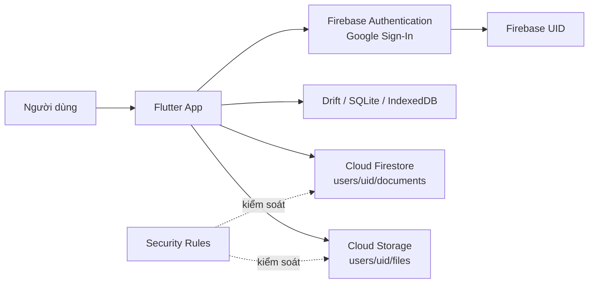

# Phân tích và phương án tích hợp Cloud cho hệ thống quản lý tài liệu

## 1. Mục tiêu

Ứng dụng quản lý tài liệu học tập được xây dựng bằng Flutter, cho phép người dùng đăng nhập bằng Google, thêm/sửa/xóa tài liệu, tìm kiếm và lọc tài liệu. Dữ liệu tài liệu được lưu cục bộ để ứng dụng có thể hoạt động nhanh trên thiết bị, đồng thời được đồng bộ lên Firebase để người dùng truy cập từ xa.

Phương án Cloud hướng tới ba mục tiêu:

- Lưu trữ dữ liệu an toàn, phân tách theo từng tài khoản.
- Cho phép truy cập dữ liệu từ nhiều thiết bị có Internet.
- Giảm phụ thuộc vào một thiết bị hoặc máy chủ vật lý duy nhất.

## 2. Phân công nhiệm vụ

| Thành viên | Checklist phụ trách | Nội dung bàn giao                                                                                                                                                                                                                |
|---|---------------------|----------------------------------------------------------------------------------------------------------------------------------------------------------------------------------------------------------------------------------|
| **Lục Văn Thuận** | **06,07**           | Tích hợp Firebase vào Flutter; đăng nhập Google bằng Firebase Authentication; lưu và đồng bộ dữ liệu bằng Cloud Firestore; hướng dẫn setup theo [Firebase Flutter Setup](https://firebase.google.com/docs/flutter/setup?hl=vi),tổng hợp nội dung thành slide tìm hiểu Firebase và cách setup tài khoản nhóm.. |
| **Hoàng Tùng** | **01**              | Liệt kê và phân tích các thành phần cốt lõi: Frontend, Backend/Service, Database và File Storage.                                                                                                                                |
| **Trần Văn Hồng Quân** | **02, 03**          | Phân tích hạn chế của hạ tầng truyền thống; so sánh Public, Private và Hybrid Cloud; đề xuất mô hình cùng dịch vụ Cloud phù hợp.                                                                                                 |
| **Nguyễn Khắc Minh Hiếu** | **04, 05**          | Thiết kế kiến trúc và luồng dữ liệu; đánh giá bảo mật, chi phí, hiệu suất;                                                                                                                                                       |

> Checklist đề bài đánh số đến mục 07, trong đó mục 07 là phần slide. Mục 06 được giao riêng cho Lục Văn Thuận theo yêu cầu.

## 3. Phân tích các thành phần cốt lõi

### 3.1. Frontend

Frontend là ứng dụng Flutter đa nền tảng, hiện có các màn hình và thành phần chính:

- `lib/main.dart`: khởi tạo Flutter, Firebase, database và điều hướng theo trạng thái đăng nhập.
- `lib/pages/document_list_page.dart`: hiển thị danh sách, tìm kiếm, lọc, sửa và xóa tài liệu.
- `lib/pages/document_form_page.dart`: nhập tiêu đề, mô tả, loại tài liệu và tệp đính kèm.
- `lib/services/auth_service.dart`: đóng gói đăng nhập Google và đăng xuất.
- `lib/repositories/document_repository.dart`: lớp trung gian giữa giao diện, database cục bộ và Firestore.

Frontend chịu trách nhiệm hiển thị và nhận thao tác người dùng. Các truy vấn database và lời gọi SDK Cloud được tách khỏi widget thông qua service/repository, giúp dễ bảo trì và kiểm thử.

### 3.2. Backend và tầng dịch vụ

Ứng dụng hiện không có máy chủ backend riêng. Các chức năng backend được cung cấp bởi Firebase:

- **Firebase Authentication** xác thực tài khoản Google, cấp Firebase UID và token.
- **Cloud Firestore** lưu metadata của tài liệu theo UID người dùng.
- **Firebase Security Rules** kiểm soát quyền đọc/ghi.
- `AuthService` và `DocumentRepository` là lớp tích hợp phía ứng dụng, che giấu chi tiết SDK Firebase khỏi giao diện.

Mô hình serverless này phù hợp với ứng dụng nhóm nhỏ vì không cần tự vận hành máy chủ, cân bằng tải hoặc hệ thống xác thực riêng.

### 3.3. Database

Database cục bộ sử dụng Drift/SQLite trên Android/iOS và IndexedDB trên Web. Bảng `Documents` gồm:

| Trường | Ý nghĩa |
|---|---|
| `id` | UUID của tài liệu |
| `title` | Tiêu đề bắt buộc |
| `description` | Mô tả |
| `type` | `lecture`, `assignment` hoặc `reference` |
| `filePath` | Đường dẫn tệp cục bộ |
| `createdAt` | Thời điểm tạo |
| `updatedAt` | Thời điểm cập nhật |

Trên Cloud Firestore, dữ liệu được lưu theo cấu trúc:

```text
users/{uid}/documents/{documentId}
```

Cách tổ chức này tạo vùng dữ liệu riêng cho từng người dùng và phù hợp với luật:

```text
request.auth.uid == userId
```

### 3.4. File Storage

Ở phiên bản hiện tại, nội dung tài liệu và tệp đính kèm vẫn được lưu cục bộ; Firestore chỉ lưu `filePath` và metadata. Đây là giới hạn quan trọng: đường dẫn cục bộ không thể dùng để tải tệp từ một thiết bị khác.

Phương án hoàn thiện cần bổ sung **Firebase Cloud Storage**:

- Tệp được tải lên `users/{uid}/files/{documentId}/{fileName}`.
- Firestore lưu `storagePath`, tên tệp, kích thước, MIME type và thời điểm tải lên.
- Khi mở tài liệu, ứng dụng lấy URL hoặc tải tệp từ Cloud Storage.
- Tệp cục bộ có thể được dùng làm cache offline.

## 4. Hạn chế của mô hình truyền thống

Mô hình truyền thống ở đây là lưu dữ liệu trên thiết bị cá nhân hoặc máy chủ vật lý nội bộ. Với ứng dụng quản lý tài liệu học tập, mô hình này gặp các hạn chế sau:

| Hạn chế | Biểu hiện | Tác động đến hệ thống |
|---|---|---|
| Lưu trữ phụ thuộc thiết bị | Dữ liệu và tệp chỉ nằm trong SQLite/IndexedDB hoặc ổ đĩa của một máy | Mất thiết bị, hỏng ổ đĩa hoặc xóa dữ liệu ứng dụng là mất toàn bộ tài liệu |
| Không truy cập từ xa | `filePath` chỉ là đường dẫn cục bộ | Người dùng không xem được tài liệu khi đổi máy hoặc ở ngoài mạng nội bộ |
| Mở rộng thủ công | Phải mua thêm ổ đĩa, máy chủ và cấu hình lại | Khó đáp ứng khi số người dùng và dung lượng tăng |
| Sao lưu chưa tự động | Chỉ có một bản sao hoặc phải sao lưu thủ công | Dễ quên sao lưu, khó khôi phục khi có sự cố |
| Xác thực phân tán | Tự quản lý tài khoản, phiên đăng nhập và quyền truy cập | Dễ sai sót bảo mật, tốn công xây dựng và bảo trì |
| Chi phí vận hành cố định | Phải duy trì phần cứng, điện, mạng và bảo trì | Tốn kém dù ít người dùng, không phù hợp với ứng dụng quy mô nhóm |
| Điểm lỗi đơn | Một máy chủ hoặc router gặp sự cố | Toàn bộ hệ thống có thể ngừng hoạt động |

**Nhận xét:** các hạn chế trên đều thể hiện ở phiên bản hiện tại của ứng dụng. Metadata đã được đồng bộ lên Firestore, nhưng tệp đính kèm vẫn nằm cục bộ nên hạn chế "không truy cập từ xa" và "lưu trữ phụ thuộc thiết bị" chưa được giải quyết hết. Đây là lý do cần một phương án Cloud hoàn chỉnh.

## 5. Lựa chọn mô hình Cloud

### 5.1. So sánh mô hình triển khai

| Tiêu chí | Public Cloud | Private Cloud | Hybrid Cloud |
|---|---|---|---|
| Khái niệm | Hạ tầng do nhà cung cấp quản lý, nhiều khách hàng dùng chung | Hạ tầng dành riêng cho một tổ chức | Kết hợp hạ tầng nội bộ/Private Cloud với Public Cloud |
| Ưu điểm | Triển khai nhanh, dịch vụ managed, mở rộng linh hoạt, trả theo mức sử dụng | Kiểm soát hạ tầng và dữ liệu cao, tùy biến sâu | Linh hoạt, giữ dữ liệu nhạy cảm nội bộ, tận dụng Cloud cho phần còn lại |
| Hạn chế | Phụ thuộc nhà cung cấp và Internet | Chi phí đầu tư, vận hành và nhân sự lớn | Kiến trúc và đồng bộ dữ liệu phức tạp |
| Chi phí | Thấp ban đầu, có hạn mức miễn phí | Cao | Trung bình đến cao |
| Công sức vận hành | Thấp | Cao | Cao |
| Khả năng mở rộng | Tự động, gần như không giới hạn | Giới hạn theo phần cứng sở hữu | Mở rộng phần Cloud, phần nội bộ vẫn giới hạn |
| Mức phù hợp | **Phù hợp nhất** | Chưa phù hợp với ứng dụng sinh viên | Có thể dùng ở giai đoạn mở rộng |

### 5.2. Phương án đề xuất

Chọn **Public Cloud theo mô hình serverless**, sử dụng hệ sinh thái Firebase:

| Nhu cầu | Dịch vụ Cloud | Vai trò |
|---|---|---|
| Xác thực người dùng | **Firebase Authentication** | Đăng nhập Google, quản lý phiên và UID |
| Lưu metadata tài liệu | **Cloud Firestore** | Lưu dữ liệu theo `users/{uid}/documents` |
| Lưu tệp đính kèm | **Cloud Storage for Firebase** | Lưu nội dung tệp tại `users/{uid}/files` |
| Phân quyền truy cập | **Firebase Security Rules** | Chỉ cho phép khi `request.auth.uid == userId` |
| Quản trị và triển khai | **Firebase Console/CLI** | Quản lý project, theo dõi và triển khai rules |

Lý do lựa chọn:

- Ứng dụng Flutter đã có `firebase_options.dart`, `google-services.json`, Firebase Authentication và Cloud Firestore nên chi phí tích hợp thấp.
- Không cần tự vận hành máy chủ, cân bằng tải hay hệ thống xác thực riêng.
- Có hạn mức miễn phí (Spark plan), phù hợp với ứng dụng học tập quy mô nhóm.
- So với tự triển khai AWS S3/Azure Blob cùng backend riêng, Firebase có ít thành phần phải vận hành hơn.
- Private Cloud tốn kém và không cần thiết ở quy mô này. Hybrid Cloud chỉ nên cân nhắc khi có dữ liệu nhạy cảm bắt buộc lưu nội bộ.

Nếu cần mở rộng cho doanh nghiệp, Cloud Storage có thể được thay thế hoặc kết nối với Google Cloud Storage thông qua backend có kiểm soát.

## 6. Kiến trúc tích hợp Cloud



### 6.1. Luồng đăng nhập

1. Người dùng chọn **Đăng nhập bằng Google**.
2. Google trả về thông tin xác thực cho ứng dụng.
3. Ứng dụng gửi credential đến Firebase Authentication.
4. Firebase xác thực và trả về Firebase User/UID.
5. Ứng dụng dùng UID để truy cập đúng vùng dữ liệu `users/{uid}`.

### 6.2. Luồng đọc dữ liệu

1. Ứng dụng khởi tạo Firebase.
2. `AuthService` theo dõi trạng thái đăng nhập.
3. Sau khi có UID, `DocumentRepository` đọc collection con `documents`.
4. Dữ liệu Cloud được ghi vào database cục bộ để hiển thị nhanh và hỗ trợ offline.

### 6.3. Luồng thêm hoặc sửa tài liệu

1. Người dùng nhập metadata và chọn tệp.
2. Ứng dụng kiểm tra kích thước và định dạng tệp.
3. Tệp được upload lên Cloud Storage.
4. Firestore lưu metadata và `storagePath`.
5. Database cục bộ cập nhật để giao diện phản hồi ngay.

### 6.4. Luồng xóa và đăng xuất

- Khi xóa tài liệu, ứng dụng xóa document Firestore và tệp Cloud Storage tương ứng.
- Khi đăng xuất, ứng dụng gọi `FirebaseAuth.signOut()` và `GoogleSignIn.signOut()`.
- Người dùng không còn token hợp lệ nên không thể đọc/ghi dữ liệu theo luật Firestore.

## 7. So sánh trước và sau khi tích hợp Cloud

| Tiêu chí | Mô hình truyền thống | Sau khi tích hợp Cloud |
|---|---|---|
| Lưu trữ | Thiết bị hoặc máy chủ nội bộ | Firestore và Cloud Storage |
| Truy cập | Chủ yếu trong một thiết bị/mạng | Nhiều thiết bị qua Internet |
| Xác thực | Có thể phải tự xây dựng | Google Sign-In + Firebase Auth |
| Phân quyền | Khó đồng bộ | Security Rules theo UID |
| Mở rộng | Mua và cấu hình phần cứng | Dịch vụ managed tự mở rộng |
| Sao lưu | Thực hiện thủ công | Có thể cấu hình backup và versioning |
| Hiệu suất | Nhanh khi chỉ dùng local | Local cache nhanh, Cloud đồng bộ khi có mạng |
| Độ phụ thuộc | Phụ thuộc thiết bị/máy chủ | Phụ thuộc Internet và nhà cung cấp Cloud |
| Chi phí | Chi phí phần cứng cố định | Trả theo sử dụng, có hạn mức miễn phí |

## 8. Đánh giá tác động

### 8.1. Bảo mật

Lợi ích:

- Firebase Authentication không cần lưu mật khẩu trong ứng dụng.
- Dữ liệu được phân tách theo UID.
- Firestore và Storage Rules ngăn người dùng truy cập dữ liệu của tài khoản khác.
- Kết nối đến Firebase sử dụng HTTPS/TLS.

Rủi ro và biện pháp:

- Không dùng rule mở toàn bộ database trong môi trường thật.
- Kiểm tra `request.auth != null` và đối chiếu UID ở mọi đường dẫn.
- Giới hạn kích thước, MIME type và phần mở rộng tệp.
- Không đưa service account key hoặc secret vào ứng dụng Flutter.
- Bật App Check khi triển khai chính thức.
- Thiết lập sao lưu, giám sát và cảnh báo chi phí.

### 8.2. Chi phí

Chi phí giảm do không phải mua và bảo trì máy chủ riêng. Với phạm vi ứng dụng học tập, Firebase Spark plan có thể đáp ứng thử nghiệm trong hạn mức miễn phí. Khi dữ liệu, lượt đọc/ghi hoặc dung lượng tệp tăng, cần theo dõi:

- Số lượt đọc/ghi/xóa Firestore.
- Dung lượng và băng thông Cloud Storage.
- Chi phí download tệp nhiều lần.
- Chi phí backup và log.

Nên phân trang danh sách, tránh đọc toàn bộ collection không cần thiết và chỉ tải tệp khi người dùng yêu cầu.

### 8.3. Hiệu suất và khả năng sẵn sàng

- Database local giúp mở danh sách và tìm kiếm nhanh.
- Firestore cung cấp đồng bộ và truy cập từ xa.
- Cloud Storage phù hợp với tệp lớn hơn Firestore.
- Ứng dụng cần xử lý trạng thái mất mạng, retry có giới hạn và xung đột cập nhật.
- Có thể dùng `updatedAt` hoặc phiên bản bản ghi để chọn dữ liệu mới nhất.

## 9. Hướng dẫn setup Firebase cho nhóm

### 9.1. Tạo và cấu hình project

1. Truy cập [Firebase Console](https://console.firebase.google.com/).
2. Tạo hoặc chọn project `quanlytailieuhoctap-cbe2e`.
3. Bật **Authentication > Sign-in method > Google**.
4. Tạo **Cloud Firestore Database**.
5. Tạo **Storage** nếu triển khai upload tệp.
6. Đăng ký ứng dụng Android với package:
   `com.example.quan_ly_tai_lieu_hoc_tap`.
7. Thêm SHA-1 và SHA-256 của debug keystore.

### 9.2. Cấu hình Flutter

```powershell
flutter pub global activate flutterfire_cli
firebase login
flutterfire configure
flutter pub get
flutter run
```

Các file cấu hình Android cần có:

```text
android/app/google-services.json
lib/firebase_options.dart
```

### 9.3. Triển khai Security Rules

```powershell
firebase use quanlytailieuhoctap-cbe2e
firebase deploy --only firestore:rules
```

Rule Firestore hiện tại giới hạn dữ liệu tài liệu theo tài khoản:

```text
match /users/{userId}/documents/{documentId} {
  allow read, write: if request.auth != null
                     && request.auth.uid == userId;
}
```

Khi bổ sung Cloud Storage, cần triển khai Storage Rules tương tự và không cho phép upload tùy ý ngoài thư mục của UID.

## 10. Nội dung slide đề xuất

Nguyễn Khắc Minh Hiếu tổng hợp slide theo bố cục   :

1. Bối cảnh và hạn chế của mô hình lưu trữ truyền thống.
2. Firebase là gì và các dịch vụ chính.
3. Kiến trúc ứng dụng Flutter hiện tại.
4. Firebase Authentication và Google Sign-In.
5. Cloud Firestore: cấu trúc `users/{uid}/documents`.
6. Cloud Storage: lưu tệp và metadata.
7. Security Rules và bảo vệ dữ liệu.
8. Các bước setup Firebase cho tài khoản nhóm.
9. So sánh trước/sau khi tích hợp Cloud.
10. Demo đăng nhập, thêm tài liệu, xem dữ liệu trên Firebase Console và đăng xuất.

## 11. Kết luận

Public Cloud với Firebase là phương án phù hợp cho hệ thống quản lý tài liệu học tập vì giảm công sức vận hành, hỗ trợ xác thực Google, cung cấp database thời gian thực và mở rộng được khi số lượng người dùng tăng. Kiến trúc hiện tại đã tích hợp Firebase Authentication và Firestore; bước hoàn thiện tiếp theo là chuyển tệp đính kèm từ đường dẫn cục bộ sang Cloud Storage, bổ sung Storage Rules, cơ chế đồng bộ khi offline và kiểm soát chi phí.


