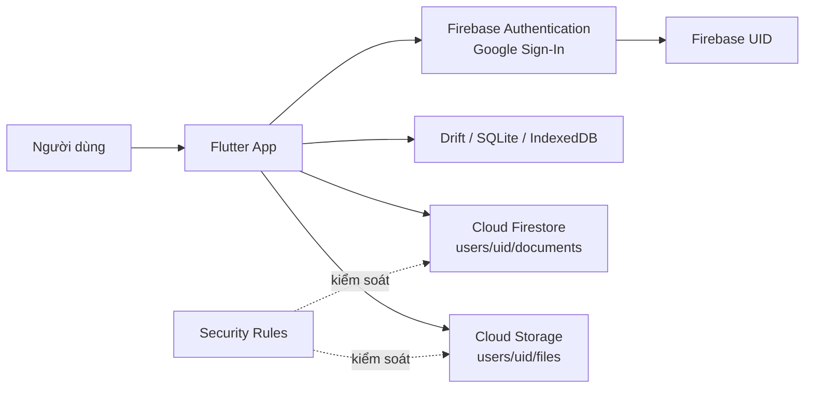

# Phân tích và phương án tích hợp Cloud cho hệ thống quản lý tài liệu

## 1. Mục tiêu

Ứng dụng quản lý tài liệu học tập được xây dựng bằng Flutter, cho phép người dùng thêm/sửa/xóa tài liệu, tìm kiếm và lọc tài liệu. Hiện tại, metadata và đường dẫn tệp được lưu cục bộ; Firebase là phương án Cloud được đề xuất để người dùng có thể truy cập dữ liệu từ xa.

Phương án Cloud hướng tới ba mục tiêu:

- Lưu trữ dữ liệu an toàn, phân tách theo từng tài khoản.
- Cho phép truy cập dữ liệu từ nhiều thiết bị có Internet.
- Giảm phụ thuộc vào một thiết bị hoặc máy chủ vật lý duy nhất.

## 2. Phân công nhiệm vụ

| Thành viên | Checklist phụ trách | Nội dung bàn giao                                                                                                                                                                                                                |
|---|---------------------|----------------------------------------------------------------------------------------------------------------------------------------------------------------------------------------------------------------------------------|
| **Lục Văn Thuận** | **06,07**           | Tích hợp Firebase vào Flutter; đăng nhập Google bằng Firebase Authentication; lưu và đồng bộ dữ liệu bằng Cloud Firestore; hướng dẫn setup theo [Firebase Flutter Setup](https://firebase.google.com/docs/flutter/setup?hl=vi),tổng hợp nội dung thành slide tìm hiểu Firebase và cách setup tài khoản nhóm.. |
| **Hoàng Tùng** | **01**              | Liệt kê và phân tích các thành phần cốt lõi: Frontend, Backend/Service, Database và File Storage.                                                                                                                                |
| **Trần Văn Hồng Quân** | **02, 03**          | Phân tích hạn chế của hạ tầng truyền thống; so sánh Public, Private và Hybrid Cloud; đề xuất mô hình cùng dịch vụ Cloud phù hợp.                                                                                                 |
| **Nguyễn Khắc Minh Hiếu** | **04, 05**          | Thiết kế kiến trúc và luồng dữ liệu; đánh giá bảo mật, chi phí, hiệu suất;                                                                                                                                                       |

> Checklist đề bài đánh số đến mục 07, trong đó mục 07 là phần slide. Mục 06 được giao riêng cho Lục Văn Thuận theo yêu cầu.

## 3. Phân tích các thành phần cốt lõi

Kiến trúc hiện tại được tổ chức theo hướng tách giao diện, nghiệp vụ và
lưu trữ. Bốn thành phần chính có vai trò như sau:

| Thành phần | Công nghệ hiện tại | Vai trò |
|---|---|---|
| Frontend | Flutter | Hiển thị giao diện, nhận thao tác và phản hồi trạng thái cho người dùng. |
| Backend/Service | `DocumentRepository`, `AuthService`, `SyncService`, `DriveService` | Đóng gói nghiệp vụ tài liệu, xác thực và các điểm tích hợp dịch vụ bên ngoài. |
| Database | Drift trên SQLite | Lưu metadata tài liệu, hỗ trợ truy vấn, tìm kiếm và cập nhật trong ứng dụng. |
| File Storage | Tệp cục bộ; Google Drive là hướng tích hợp | Lưu đường dẫn tệp đính kèm ở local và chuẩn bị API upload lên Cloud. |

### 3.1. Frontend

Frontend là ứng dụng Flutter đa nền tảng. Lớp giao diện hiện có các màn hình
và thành phần chính:

- `lib/main.dart`: khởi tạo Flutter, database và màn hình chính.
- `lib/pages/document_list_page.dart`: hiển thị danh sách, tìm kiếm, lọc, sửa và xóa tài liệu.
- `lib/pages/document_form_page.dart`: nhập tiêu đề, mô tả, loại tài liệu và tệp đính kèm.
- `lib/models/document_struct.dart`: định nghĩa loại tài liệu và mô hình dữ liệu dùng ở giao diện.
- `lib/repositories/document_repository.dart`: lớp trung gian giữa giao diện và database.

Frontend chỉ nên chịu trách nhiệm hiển thị và nhận thao tác người dùng.
Các truy vấn database và lời gọi dịch vụ được tách khỏi widget thông qua
repository/service, giúp dễ bảo trì và kiểm thử.

### 3.2. Backend và tầng dịch vụ

Ứng dụng hiện chưa có máy chủ backend riêng. Nghiệp vụ phía sau giao diện
được tổ chức trong các lớp service/repository:

- **`DocumentRepository`** thực hiện tạo, đọc, tìm kiếm, lọc và xóa tài liệu.
- **`AuthService`** định nghĩa điểm tích hợp cho đăng nhập Google và đăng xuất.
- **`DriveService`** đóng gói thao tác upload tệp và database lên Google Drive
  thông qua `googleapis`.
- **`SyncService`** là điểm mở rộng cho đồng bộ dữ liệu; hiện chưa thực hiện
  đồng bộ tự động.

Việc tách các lớp này giúp thay đổi nhà cung cấp Cloud hoặc bổ sung backend
mà không phải viết lại giao diện. Khi triển khai thật, cần bổ sung cơ chế
xác thực, xử lý lỗi, retry có giới hạn và phân quyền ở dịch vụ Cloud.

### 3.3. Database

Database hiện tại sử dụng Drift với SQLite trên nền tảng native. Drift cung
cấp API kiểu Dart, stream theo dõi thay đổi và sinh mã truy cập bảng. Bảng
`Documents` gồm:

| Trường | Ý nghĩa |
|---|---|
| `id` | UUID của tài liệu |
| `title` | Tiêu đề bắt buộc |
| `description` | Mô tả |
| `type` | `lecture`, `assignment` hoặc `reference` |
| `filePath` | Đường dẫn tệp cục bộ |
| `createdAt` | Thời điểm tạo |
| `updatedAt` | Thời điểm cập nhật |

`DocumentRepository.watchDocuments()` thực hiện sắp xếp theo thời điểm cập
nhật, lọc theo loại tài liệu và tìm kiếm không phân biệt dấu trong tiêu đề.
Database local giúp ứng dụng phản hồi nhanh và vẫn đọc được metadata khi
không có mạng.

Nếu bổ sung database Cloud, dữ liệu cần được gắn với danh tính người dùng,
chẳng hạn theo cấu trúc `users/{uid}/documents/{documentId}`. Luật đọc/ghi
phải kiểm tra người dùng đã đăng nhập và UID trong đường dẫn trùng với UID
trong phiên hiện tại.

### 3.4. File Storage

Ở phiên bản hiện tại, bảng `Documents` chỉ lưu `filePath`; nội dung tệp
đính kèm vẫn nằm trên thiết bị. Vì vậy, đường dẫn local không thể dùng để
tải tệp từ thiết bị khác và dữ liệu có thể mất khi tệp bị di chuyển hoặc
thiết bị gặp sự cố.

Project đã có `DriveService` để chuẩn bị upload dữ liệu lên Google Drive:

- `uploadAttachment()` nhận bytes, tên tệp và MIME type rồi tạo tệp trên Drive.
- `uploadDatabase()` hỗ trợ upload file SQLite làm bản sao lưu.
- `SyncService` có thể được mở rộng để đồng bộ metadata và tệp theo lịch.

Để hoàn thiện file storage, cần lưu thêm ID/đường dẫn tệp Cloud, tên tệp,
kích thước, MIME type và thời điểm upload trong database. Tệp local nên được
giữ làm cache offline; khi mở tài liệu trên thiết bị khác, ứng dụng tải tệp
từ Cloud về cache trước khi sử dụng. Dịch vụ Cloud cũng phải giới hạn quyền
truy cập theo tài khoản và kiểm tra kích thước, MIME type trước khi upload.

## 4. Hạn chế của mô hình truyền thống

Nếu chỉ lưu dữ liệu trên thiết bị hoặc máy chủ vật lý nội bộ, hệ thống gặp các vấn đề sau:

| Hạn chế | Tác động |
|---|---|
| Lưu trữ phụ thuộc thiết bị | Mất thiết bị hoặc hỏng ổ đĩa có thể làm mất dữ liệu. |
| Không truy cập từ xa | Người dùng khó xem tài liệu khi đổi máy hoặc ngoài mạng nội bộ. |
| Mở rộng thủ công | Phải mua thêm ổ đĩa, máy chủ và cấu hình lại hệ thống khi dữ liệu tăng. |
| Sao lưu chưa tự động | Dễ quên sao lưu hoặc chỉ có một bản sao dự phòng. |
| Xác thực phân tán | Khó quản lý tài khoản, phiên đăng nhập và quyền truy cập. |
| Chi phí vận hành cố định | Phải duy trì phần cứng, điện, mạng và bảo trì ngay cả khi ít sử dụng. |
| Điểm lỗi đơn | Một máy chủ hoặc router gặp sự cố có thể làm toàn hệ thống ngừng hoạt động. |

## 5. Lựa chọn mô hình Cloud

### 5.1. So sánh mô hình triển khai

| Mô hình | Ưu điểm | Hạn chế | Mức phù hợp |
|---|---|---|---|
| Public Cloud | Triển khai nhanh, dịch vụ managed, mở rộng linh hoạt, trả theo mức sử dụng | Phụ thuộc nhà cung cấp và Internet | **Phù hợp nhất** |
| Private Cloud | Kiểm soát hạ tầng và dữ liệu cao | Chi phí đầu tư, vận hành và nhân sự lớn | Chưa phù hợp với ứng dụng sinh viên |
| Hybrid Cloud | Kết hợp dữ liệu nội bộ và Cloud, linh hoạt với dữ liệu nhạy cảm | Kiến trúc và đồng bộ phức tạp | Có thể dùng ở giai đoạn mở rộng |

### 5.2. Phương án đề xuất

Chọn **Public Cloud theo mô hình serverless**, sử dụng hệ sinh thái Firebase:

- **Firebase Authentication**: đăng nhập Google, quản lý phiên và UID.
- **Cloud Firestore**: lưu metadata và dữ liệu tài liệu.
- **Cloud Storage for Firebase**: lưu nội dung tệp đính kèm.
- **Firebase Security Rules**: phân quyền theo `request.auth.uid`.
- **Firebase Console/CLI**: quản trị project, theo dõi và triển khai rules.

Firebase được đề xuất vì phù hợp với Flutter và giúp giảm số lượng thành phần phải vận hành so với tự triển khai AWS S3/Azure Blob cùng backend riêng. Khi triển khai, nhóm cần bổ sung các file cấu hình Firebase, bật Authentication/Firestore và kết nối các service hiện tại với SDK tương ứng. Nếu cần mở rộng doanh nghiệp, Cloud Storage có thể được thay thế hoặc kết nối với Google Cloud Storage thông qua backend có kiểm soát.

## 6. Kiến trúc tích hợp Cloud



### 6.1. Luồng đăng nhập

1. Người dùng chọn **Đăng nhập bằng Google**.
2. Google trả về thông tin xác thực cho ứng dụng.
3. Ứng dụng gửi credential đến Firebase Authentication.
4. Firebase xác thực và trả về Firebase User/UID.
5. Ứng dụng dùng UID để truy cập đúng vùng dữ liệu `users/{uid}`.

### 6.2. Luồng đọc dữ liệu

1. Ứng dụng khởi tạo Firebase.
2. `AuthService` theo dõi trạng thái đăng nhập.
3. Sau khi có UID, `DocumentRepository` đọc collection con `documents`.
4. Dữ liệu Cloud được ghi vào database cục bộ để hiển thị nhanh và hỗ trợ offline.

### 6.3. Luồng thêm hoặc sửa tài liệu

1. Người dùng nhập metadata và chọn tệp.
2. Ứng dụng kiểm tra kích thước và định dạng tệp.
3. Tệp được upload lên Cloud Storage.
4. Firestore lưu metadata và `storagePath`.
5. Database cục bộ cập nhật để giao diện phản hồi ngay.

### 6.4. Luồng xóa và đăng xuất

- Khi xóa tài liệu, ứng dụng xóa document Firestore và tệp Cloud Storage tương ứng.
- Khi đăng xuất, ứng dụng gọi `FirebaseAuth.signOut()` và `GoogleSignIn.signOut()`.
- Người dùng không còn token hợp lệ nên không thể đọc/ghi dữ liệu theo luật Firestore.

## 7. So sánh trước và sau khi tích hợp Cloud

| Tiêu chí | Mô hình truyền thống | Sau khi tích hợp Cloud |
|---|---|---|
| Lưu trữ | Thiết bị hoặc máy chủ nội bộ | Firestore và Cloud Storage |
| Truy cập | Chủ yếu trong một thiết bị/mạng | Nhiều thiết bị qua Internet |
| Xác thực | Có thể phải tự xây dựng | Google Sign-In + Firebase Auth |
| Phân quyền | Khó đồng bộ | Security Rules theo UID |
| Mở rộng | Mua và cấu hình phần cứng | Dịch vụ managed tự mở rộng |
| Sao lưu | Thực hiện thủ công | Có thể cấu hình backup và versioning |
| Hiệu suất | Nhanh khi chỉ dùng local | Local cache nhanh, Cloud đồng bộ khi có mạng |
| Độ phụ thuộc | Phụ thuộc thiết bị/máy chủ | Phụ thuộc Internet và nhà cung cấp Cloud |
| Chi phí | Chi phí phần cứng cố định | Trả theo sử dụng, có hạn mức miễn phí |

## 8. Đánh giá tác động

### 8.1. Bảo mật

Lợi ích:

- Firebase Authentication không cần lưu mật khẩu trong ứng dụng.
- Dữ liệu được phân tách theo UID.
- Firestore và Storage Rules ngăn người dùng truy cập dữ liệu của tài khoản khác.
- Kết nối đến Firebase sử dụng HTTPS/TLS.

Rủi ro và biện pháp:

- Không dùng rule mở toàn bộ database trong môi trường thật.
- Kiểm tra `request.auth != null` và đối chiếu UID ở mọi đường dẫn.
- Giới hạn kích thước, MIME type và phần mở rộng tệp.
- Không đưa service account key hoặc secret vào ứng dụng Flutter.
- Bật App Check khi triển khai chính thức.
- Thiết lập sao lưu, giám sát và cảnh báo chi phí.

### 8.2. Chi phí

Chi phí giảm do không phải mua và bảo trì máy chủ riêng. Với phạm vi ứng dụng học tập, Firebase Spark plan có thể đáp ứng thử nghiệm trong hạn mức miễn phí. Khi dữ liệu, lượt đọc/ghi hoặc dung lượng tệp tăng, cần theo dõi:

- Số lượt đọc/ghi/xóa Firestore.
- Dung lượng và băng thông Cloud Storage.
- Chi phí download tệp nhiều lần.
- Chi phí backup và log.

Nên phân trang danh sách, tránh đọc toàn bộ collection không cần thiết và chỉ tải tệp khi người dùng yêu cầu.

### 8.3. Hiệu suất và khả năng sẵn sàng

- Database local giúp mở danh sách và tìm kiếm nhanh.
- Firestore cung cấp đồng bộ và truy cập từ xa.
- Cloud Storage phù hợp với tệp lớn hơn Firestore.
- Ứng dụng cần xử lý trạng thái mất mạng, retry có giới hạn và xung đột cập nhật.
- Có thể dùng `updatedAt` hoặc phiên bản bản ghi để chọn dữ liệu mới nhất.

## 9. Hướng dẫn setup Firebase cho nhóm

### 9.1. Tạo và cấu hình project

1. Truy cập [Firebase Console](https://console.firebase.google.com/).
2. Tạo hoặc chọn project `quanlytailieuhoctap-cbe2e`.
3. Bật **Authentication > Sign-in method > Google**.
4. Tạo **Cloud Firestore Database**.
5. Tạo **Storage** nếu triển khai upload tệp.
6. Đăng ký ứng dụng Android với package:
   `com.example.quan_ly_tai_lieu_hoc_tap`.
7. Thêm SHA-1 và SHA-256 của debug keystore.

### 9.2. Cấu hình Flutter

```powershell
flutter pub global activate flutterfire_cli
firebase login
flutterfire configure
flutter pub get
flutter run
```

Các file cấu hình Android cần có:

```text
android/app/google-services.json
lib/firebase_options.dart
```

### 9.3. Triển khai Security Rules

```powershell
firebase use quanlytailieuhoctap-cbe2e
firebase deploy --only firestore:rules
```

Rule Firestore hiện tại giới hạn dữ liệu tài liệu theo tài khoản:

```text
match /users/{userId}/documents/{documentId} {
  allow read, write: if request.auth != null
                     && request.auth.uid == userId;
}
```

Khi bổ sung Cloud Storage, cần triển khai Storage Rules tương tự và không cho phép upload tùy ý ngoài thư mục của UID.

## 10. Nội dung slide đề xuất

Nguyễn Khắc Minh Hiếu tổng hợp slide theo bố cục:

1. Bối cảnh và hạn chế của mô hình lưu trữ truyền thống.
2. Firebase là gì và các dịch vụ chính.
3. Kiến trúc ứng dụng Flutter hiện tại.
4. Firebase Authentication và Google Sign-In.
5. Cloud Firestore: cấu trúc `users/{uid}/documents`.
6. Cloud Storage: lưu tệp và metadata.
7. Security Rules và bảo vệ dữ liệu.
8. Các bước setup Firebase cho tài khoản nhóm.
9. So sánh trước/sau khi tích hợp Cloud.
10. Demo đăng nhập, thêm tài liệu, xem dữ liệu trên Firebase Console và đăng xuất.

## 11. Kết luận

Public Cloud với Firebase là phương án phù hợp cho hệ thống quản lý tài liệu học tập vì giảm công sức vận hành, hỗ trợ xác thực Google, cung cấp database thời gian thực và mở rộng được khi số lượng người dùng tăng. Kiến trúc hiện tại đang ưu tiên database local; bước hoàn thiện tiếp theo là tích hợp Firebase Authentication/Firestore, chuyển tệp đính kèm từ đường dẫn cục bộ sang Cloud Storage, bổ sung Storage Rules, cơ chế đồng bộ khi offline và kiểm soát chi phí.