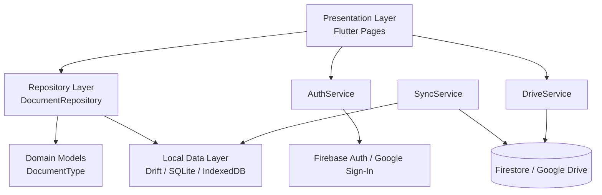
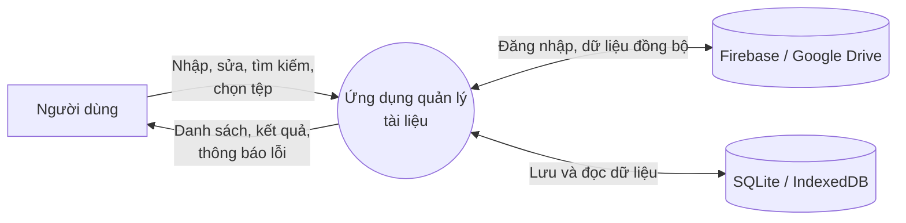
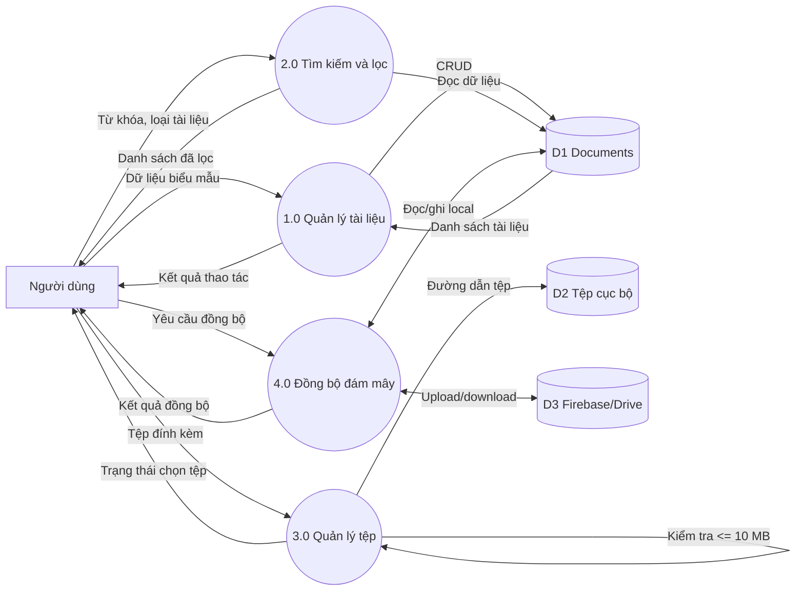
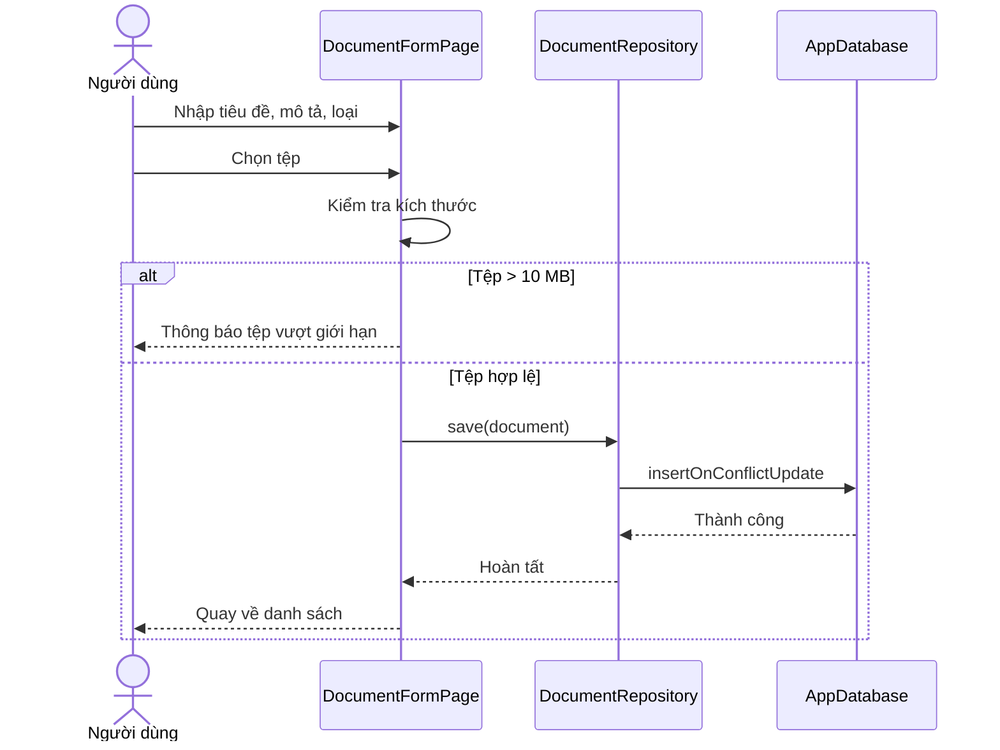

# Báo cáo kiến trúc ứng dụng quản lý tài liệu học tập

## 1. Tổng quan

Ứng dụng quản lý tài liệu học tập được xây dựng bằng Flutter/Dart, hỗ trợ lưu tài liệu cục bộ trên Android/iOS và Web, tìm kiếm gần đúng theo tiêu đề, phân loại tài liệu, đính kèm tệp, chỉnh sửa và xóa tài liệu.

Kiến trúc được tổ chức theo mô hình **Cashew Stack**:

```text
Presentation -> Repository -> Services/Domain -> Database
```

Mục tiêu của cách tổ chức này là tách giao diện khỏi dữ liệu và SDK bên ngoài, giúp thay đổi giao diện, cơ chế lưu trữ hoặc dịch vụ đám mây mà không làm lan truyền thay đổi sang toàn bộ ứng dụng.

## 2. Phân tích yêu cầu chức năng

| Mã | Chức năng | Mô tả | Thành phần chính |
|---|---|---|---|
| FR-01 | Khởi tạo ứng dụng | Khởi tạo Flutter, kết nối database theo nền tảng và hiển thị màn hình chính. | `main.dart`, `database/platform` |
| FR-02 | Thêm tài liệu | Nhập tiêu đề, mô tả, loại tài liệu và chọn tệp đính kèm. | `document_form_page.dart` |
| FR-03 | Kiểm tra tệp | Từ chối tệp có dung lượng lớn hơn 10 MB và thông báo cho người dùng. | `document_form_page.dart` |
| FR-04 | Sửa tài liệu | Nạp dữ liệu cũ vào biểu mẫu, cho phép cập nhật nội dung và tệp. | `document_form_page.dart`, `repository` |
| FR-05 | Xóa tài liệu | Xóa tài liệu theo mã định danh. | `document_list_page.dart`, `repository` |
| FR-06 | Liệt kê tài liệu | Hiển thị danh sách theo thời gian cập nhật mới nhất. | `document_list_page.dart` |
| FR-07 | Tìm kiếm | Tìm gần đúng theo tiêu đề, không phân biệt hoa thường và dấu tiếng Việt. | `document_repository.dart` |
| FR-08 | Lọc tài liệu | Lọc theo Lecture, Assignment hoặc Reference. | `document_repository.dart` |
| FR-09 | Lưu cục bộ | Lưu dữ liệu bằng SQLite trên native và IndexedDB trên Web. | `database.dart`, `platform` |
| FR-10 | Đăng nhập Google | Chuẩn bị luồng xác thực Firebase Auth và Google Sign-In. | `auth_service.dart` |
| FR-11 | Sao lưu tệp | Chuẩn bị upload tệp và database lên Google Drive. | `drive_service.dart` |
| FR-12 | Đồng bộ | Tách riêng logic đồng bộ local database với dịch vụ đám mây. | `sync_service.dart` |

### Quy tắc nghiệp vụ

1. Tiêu đề là trường bắt buộc và được loại bỏ khoảng trắng đầu/cuối trước khi lưu.
2. Mỗi tài liệu có một mã định danh UUID.
3. Tệp đính kèm không được lớn hơn 10 MB.
4. Các từ khóa tìm kiếm được chuẩn hóa về chữ thường, loại bỏ dấu tiếng Việt và gom khoảng trắng.
5. Một tài liệu thuộc đúng một loại: bài giảng, bài tập hoặc tài liệu tham khảo.
6. Thời điểm tạo và cập nhật được lưu cùng bản ghi.

## 3. Sơ đồ kiến trúc tổng thể



### Ánh xạ thư mục

| Tầng | Thư mục/file | Trách nhiệm |
|---|---|---|
| Bootstrap | `lib/main.dart` | Khởi tạo binding, database và dependency cho màn hình gốc. |
| Presentation | `lib/pages/` | Hiển thị danh sách, biểu mẫu, tìm kiếm, lọc và thông báo. |
| Domain | `lib/models/` | Mô hình hóa loại tài liệu và quy tắc chuyển đổi dữ liệu. |
| Repository | `lib/repositories/` | Cung cấp API CRUD, lọc và tìm kiếm; che giấu Drift khỏi UI. |
| Database | `lib/database/` | Định nghĩa bảng Drift, kết nối theo nền tảng và mã sinh tự động. |
| Services | `lib/services/` | Đóng gói Firebase, Google Sign-In, Google Drive và đồng bộ. |

## 4. Thiết kế sơ đồ luồng dữ liệu

### 4.1. DFD mức ngữ cảnh



### 4.2. DFD mức 1



### 4.3. Luồng thêm tài liệu



## 5. Áp dụng kiến trúc Cashew

Trong dự án này, Cashew được áp dụng như một kiến trúc phân lớp hướng repository:

### 5.1. Bootstrap và dependency wiring

`main.dart` chỉ chịu trách nhiệm khởi tạo Flutter binding, chọn implementation kết nối database bằng conditional import, tạo `AppDatabase`, sau đó truyền `DocumentRepository` vào màn hình. UI không tự mở file database và không tự tạo truy vấn Drift.

### 5.2. Data layer

`database.dart` định nghĩa bảng `Documents` và `AppDatabase`. `database.g.dart` do Drift tự sinh, không chỉnh sửa thủ công. Các file trong `database/platform` tách biệt:

- `native.dart`: SQLite native thông qua `NativeDatabase`.
- `web.dart`: IndexedDB thông qua `WebDatabase`.
- `stub.dart`: báo lỗi rõ ràng với nền tảng không hỗ trợ.

Nhờ đó, phần còn lại của ứng dụng chỉ làm việc với `AppDatabase`, không phụ thuộc chi tiết nền tảng.

### 5.3. Repository layer

`DocumentRepository` là abstraction layer giữa presentation và database. Repository đảm nhiệm:

- CRUD tài liệu.
- Chuẩn hóa chuỗi tìm kiếm.
- Tìm gần đúng theo nhiều từ khóa.
- Lọc theo loại tài liệu.
- Tạo UUID và quản lý thời gian cập nhật.

Đây là điểm mở rộng phù hợp để bổ sung cache, phân trang hoặc thay database mà không sửa các widget.

### 5.4. Service layer

Các SDK bên ngoài được cô lập trong services:

- `AuthService`: Firebase Auth và Google Sign-In.
- `DriveService`: upload tệp và file database lên Google Drive.
- `SyncService`: điều phối đồng bộ local/cloud.

Việc tách SDK khỏi page giúp UI không biết cách tạo credential, gọi Drive API hoặc xử lý token.

### 5.5. Presentation layer

`DocumentListPage` hiển thị dữ liệu từ stream của repository và xử lý thao tác điều hướng. `DocumentFormPage` quản lý trạng thái biểu mẫu, xác thực dữ liệu, chọn tệp và thông báo cho người dùng. Các widget không chứa SQL hoặc logic xác thực cloud.

### 5.6. Lợi ích đạt được

- **Dễ bảo trì:** mỗi thay đổi tập trung trong đúng tầng.
- **Dễ kiểm thử:** repository và service có thể kiểm thử độc lập với widget.
- **Đa nền tảng:** native/web được chọn tại điểm kết nối database.
- **Mở rộng an toàn:** có thể thay SQLite bằng backend khác qua repository.
- **Giảm phụ thuộc:** UI không bị khóa vào Drift, Firebase hoặc Google Drive.

## 6. Cấu trúc mã nguồn bàn giao

```text
lib/
├── main.dart
├── database/
│   ├── database.dart
│   ├── database.g.dart
│   └── platform/
├── models/
├── services/
├── repositories/
└── pages/
docs/
└── ARCHITECTURE_REPORT.md
```

## 7. Cách chạy và tái tạo mã sinh

```powershell
flutter pub get
dart run build_runner build
flutter analyze
flutter run -d emulator-5554
```

Build Android debug:

```powershell
flutter build apk --debug
```

APK được tạo tại:

```text
build\app\outputs\flutter-apk\app-debug.apk
```

## 8. Phạm vi và hướng phát triển

Các service Firebase/Drive đã được cô lập để sẵn sàng tích hợp, nhưng việc đồng bộ thực tế cần cấu hình Firebase project, OAuth client, quyền Google Drive và chiến lược xử lý xung đột. Các hướng phát triển tiếp theo gồm:

1. Thêm trạng thái đồng bộ và thời điểm đồng bộ cuối.
2. Tải byte tệp lên Drive thay vì chỉ lưu đường dẫn cục bộ.
3. Thêm xác thực người dùng trước khi truy cập dữ liệu cloud.
4. Xử lý xung đột theo `updatedAt` hoặc phiên bản bản ghi.
5. Bổ sung unit test cho repository và integration test cho database.
